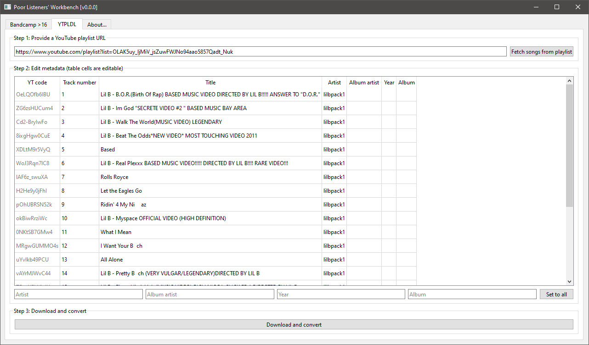

# Poor Listeners' Workbench

* [What is this?](#what-is-this)
* [Features](#features)
* [Running on Windows](#running-on-windows)
* [Troubleshooting](#troubleshooting)
* [Dependencies](#dependencies)
* [Law, Order, and Call to Action](#law-order-and-call-to-action)
* [Changelog](#changelog)

## What is this?

In its current state, this app is a simple GUI wrapper around `yt-dlp` that allows you to download MP3s from Bandcamp and YouTube playlists.



## Features

### Bandcamp DL

Lets you choose which albums to download in MP3 for given Bandcamp artist's "music grid" URL.

Otiel's [_BandcampDownloader_](https://github.com/Otiel/BandcampDownloader/) is more ergonomic and has more options, so I recommend using that instead. However, at the time of writing, Otiel's _BandcampDownloader_ is not working, so this is a good fallback option.

### YTPLDL – YouTube playlist DL

Downloads MP3 files for given YouTube playlist URL. ID3v2 tags can be modified in the UI.

## Running on Windows

1. Install Python 3 – [Download Python @ python.org](https://www.python.org/downloads/)
2. Install FFmpeg – [Installing FFmpeg on Windows {Step-by-Step} @ phoenixnap.com](https://phoenixnap.com/kb/ffmpeg-windows)
3. Install dependencies and run the app:
   * Option A – install dependencies globally:
     * Open command line in the root folder of this project and run `pip install -r requirements.txt`
     * After that, you can run the app by double clicking `main.py`
   * Option B – install dependencies in virtual environment:
     * Run the app by right clicking `Run-In-Venv.ps1` and choosing _Run with PowerShell_
     * The first boot will be slow because it installs all the dependencies

## Troubleshooting

If downloading from YouTube (or other sites) stops working, first thing to try is updating the `yt-dlp` package:

```ps1
# Run this line first in the root folder of this project
# only if you chose Option B (virtual environment):
.venv\Scripts\activate

# Running this line will update the yt-dlp package:
pip install -U yt-dlp
```

## Dependencies

* Python 3
* FFmpeg
* PySide 6&ensp;(LGPL)
* Beautiful Soup 4&ensp;(MIT)
* [h2non/jsonpath-ng](https://github.com/h2non/jsonpath-ng)&ensp;([Apache 2.0](https://github.com/h2non/jsonpath-ng/blob/master/LICENSE))
* [yt-dlp](https://github.com/yt-dlp/yt-dlp)&ensp;([Unlicense](https://github.com/yt-dlp/yt-dlp/blob/master/LICENSE))

## Law, Order, and Call to Action

Downloading music for personal use may not be legal where you live. Find out what your options are and (don't) use tools like this accordingly. If you want to support your favorite artists, buy their stuff on Bandcamp. If you are an artist worried about their work being "stolen", Bandcamp has [an answer](https://get.bandcamp.help/hc/en-us/articles/23020694039575-I-heard-you-can-steal-music-on-Bandcamp-What-are-you-doing-about-this) for you.

<b>"Why don't you just use Spotify?"</b>

There is a certain charm in maintaining your own offline music library. It comes with its own set of quirks, but has pros as well:

* No monthly subscription or ads
* No dependence on a third-party corporation (which may change its terms or go bankrupt)
* You don't have to worry about music that is missing from streaming platforms
* You can listen to music in higher quality
* If you like stats, you can still use Last.fm or ListenBrainz
  * These can also be used for discovering new music
* You can choose your own music player
* The directory structure allows for more flexible sorting than a set of playlists
* You can edit your audio files: maybe you really like only part of a song and don't like the rest, so you can just cut it out
* There are definitely more devices and HW/SW configurations that can play MP3 files than there are devices that can run the Spotify app

You could certainly compile a similar list of advantages of music streaming platforms or disadvantages of offline audio libraries. Just keep in mind that this option exists. Then there is also this somewhat darker problem with streaming services and music distributors: how they treat genuine independent artists while letting all kinds of scams and a flood of AI music slip through their fingers. There are many discussions on this issue. If you are interested, I think this video by Venus Theory sums it up nicely: [It's Not Just You: Music Streaming Is Broken Now](https://youtu.be/plleJ0Zv0Ww).

Maybe the time is now to become your own master! (At least when it comes to listening to music.)

## Changelog

### 0.2.1

* _Bandcamp DL_:
  * Downloaded MP3s now don't have any comment tag
  * File names of downloaded MP3s now have track number in `02d` format (two digits, zero padded)
  * Added _(Un)check all_ button for checking/unchecking all the checkboxes in the album table
  * Checkboxes are now centered in their table cell

### 0.2.0

* _Bandcamp DL_ feature was added

### 0.1.0

* YTPLDL: The index of the first song to be downloaded can now be specified. This is useful for resuming a previously interrupted download.

### 0.0.1

* Initial release
